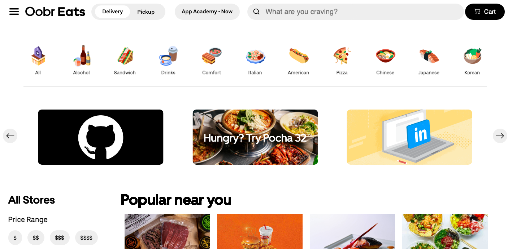
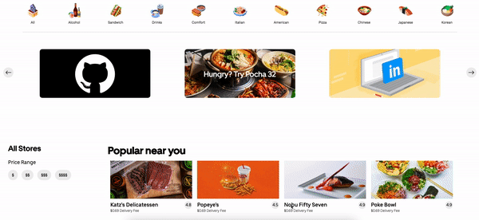
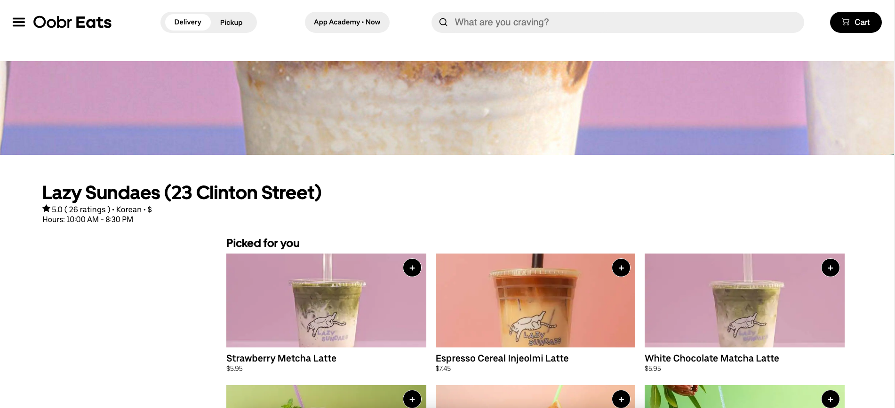

# Oobr Eats

Live Link: [Oobr Eats](https://oobr-eats.herokuapp.com/#/) 

Oobr Eats is an Uber Eats inspired single-page website. You can browse and order from restaurants located in New York, New York.



## Features

### Restaurants View


The restaurants are fetched upon login and acts as the main page. There will be a selection of 20 restaurants to view from. You are able to filter restaurants by price range and categories.

```
    {Object.values(props.restaurants).map((restaurant) => {
        if (restaurant.description.includes(props.filter) || restaurant.pricing_rating === (props.filter)) {
        return (
            <div className="restaurant" key={restaurant.id} onClick={() => restaurantRoute(restaurant.id)}>
                <h2 className="restaurant-index-text">{props.filter} </h2>
                
                <div className="restaurant-index-info">
                    <p className="restaurant-index-name">{restaurant.name}</p>
                    <div className="restaurant-index-rating">{restaurant.rating.toFixed(1)}</div>
                </div>
                <div className="delivery-fee">$0.69 Delivery Fee</div>
            </div>
        )} else if (props.filter === undefined || props.filter === null) {
            return (
                <div className="restaurant" key={restaurant.id} onClick={() => restaurantRoute(restaurant.id)}>
                    <h2 className="restaurant-index-text">Popular near you </h2>
                    
                    <div className="restaurant-index-info">
                        <p className="restaurant-index-name">{restaurant.name}</p>
                        <div className="restaurant-index-rating">{restaurant.rating.toFixed(1)}</div>
                    </div>
                    <div className="delivery-fee">$0.69 Delivery Fee</div>
                </div>
            )
        }
    })}
```

Filtering by category:



```
    const renderCategories = () => {
        return (
            <div className="categories-container">
                {Object.keys(CATEGORIES).map((category, i) => {
                    return (
                        <button onClick={() => handleFilterClick(category)} key={i} className="category-button">
                            
                            <div className="category-text">{category}</div>
                        </button>
                    )
                })}
            </div>
        )
    }
```

### Restaurant Show



Each restaurant will have a range of seven to nine menu items you can view from. An item modal will show when clicked and which will provide the user the option to add the item to their cart.


### Cart and Checkout

Once Users have finalized their cart, they can checkout and process their transaction.


## Technologies

**Frontend:** React and Redux

- Rendering and navigation of the website
- Persists state to support the adding adding/removing of cart items.

**Backend:** Ruby on Rails with a PostgreSQL database

- Supports back-end server access, and acts as a middleware for the PostgreSQL database, manipulating the database where needed.
- Handles User Authentication via session tokens which are then bootstrapped to the window and sent forward to the front-end.

**Other:** Google Maps JavaScript API, Amazon AWS S3, Javascript, Tiny-Carousel Library

- Google Maps API was utilized to create markers to pinpoint accurate locations of each restaurants location. Hovering the markers will render a information window to show restaurant info.

- Amazon AWS S3 handles the image hosting to allow for a more lightweight implementation of the app.

- Tiny-Carousel was utilize to imitate the animation of a image coursel.

**Hosting:** Oobr Eats is hosted on Heroku

## Future Plans

- User's option to create reviews. Review would be rendered on to respective restaurant's page.
- Ability to search specific cuisines or restaurants
- Add Google Maps Distance Matrix API to allow for ETA calculation.

## Credits

All images are sourced from Uber Eats and respective restaurants. 

